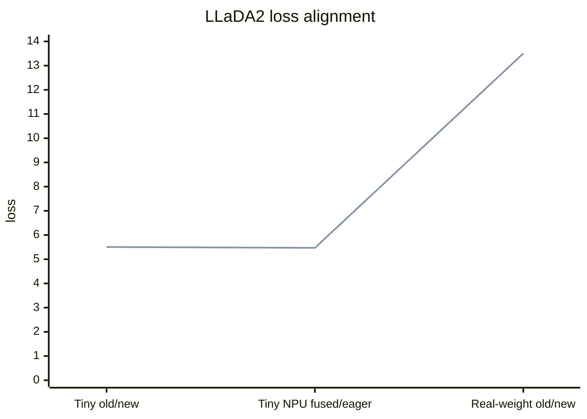

# dFactory VeOmni/NPU 迁移验证报告

日期：2026-06-25

## 验证范围

本报告记录迁移验证结果。验证脚本和辅助下载/资产检查工具保留在本完整交付分支中，不进入上游核心 PR。

已验证：

- 核心 Python 文件静态编译。
- SFT YAML 配置解析。
- Ascend 910B2 单卡 NPU `fused_npu` MoE 路径。
- 旧代码 tiny eager parity。
- 真实 LLaDA2.0 mini preview 权重旧/新 forward parity。

未验证：

- SP。
- EP。
- 多卡 FSDP2/EP/SP 组合训练。
- 真实 16B 权重 backward。
- 多步真实 SFT loss 曲线。

## 验证结果

| 验证项 | 环境 | 结果 |
| --- | --- | --- |
| core py_compile | macOS 本地 | 通过 |
| SFT YAML parse | macOS 本地 | 通过 |
| CPU eager tiny smoke | 远端 `veomni_qwen35` | loss `5.636879920959473` |
| NPU fused_npu vs eager tiny | Ascend 910B2 | kernel `npu_fused_moe_forward`，loss/logits/grad diff `0.0` |
| 旧代码 vs 当前代码 tiny eager | Ascend 910B2 | current loss = legacy loss = `5.506927490234375`，loss/logits/full-gradient diff `0.0` |
| 真实权重旧代码 vs 当前代码 | Ascend 910B2，bf16，forward-only | current loss = legacy loss = `13.501853942871094`，loss/logits diff `0.0` |

## Loss 对齐图

下面是已完成验证点的 loss 对齐图。它不是多步训练 loss 曲线；多步曲线需要后续真实 SFT 训练验证补充。



## 真实权重对齐摘要

```json
{
  "device": "npu",
  "dtype": "bfloat16",
  "attn": "eager",
  "backward": false,
  "current_loss": 13.501853942871094,
  "legacy_loss": 13.501853942871094,
  "loss_abs_diff": 0.0,
  "logits": {
    "max_abs": 0.0,
    "mean_abs": 0.0,
    "max_rel": 0.0
  },
  "current_shards_count": 7,
  "legacy_shards_count": 7,
  "current_missing_count": 0,
  "current_unexpected_count": 0,
  "legacy_missing_count": 0,
  "legacy_unexpected_count": 0
}
```

## SP / EP 结论

当前 PR 没有验证 SP 和 EP。SP/EP 仍属于后续大规模生产化验证项，需要在多卡 NPU 上补齐：

- SP 下 attention/RoPE/mask 行为。
- EP 下 MoE routing、expert weight 分片/聚合、checkpoint save/load。
- SP/EP/FSDP2 组合下的性能、显存、通信和精度曲线。
