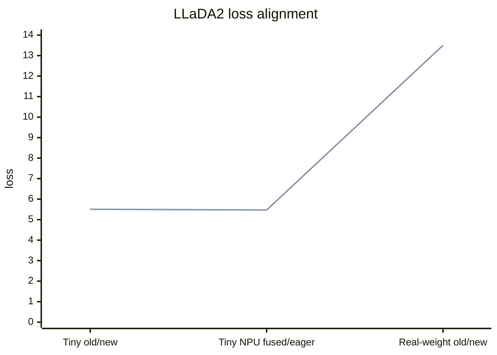

# dFactory VeOmni/NPU 迁移验证报告

日期：2026-06-25

## 验证范围

本报告记录迁移验证结果。验证脚本和辅助下载/资产检查工具保留在本完整交付分支中，不进入上游核心 PR。

已验证：

- 核心 Python 文件静态编译。
- SFT YAML 配置解析。
- Ascend 910B2 单卡 NPU `fused_npu` MoE 路径。
- 旧代码 tiny eager parity。
- 真实 LLaDA2.0 mini preview 权重旧/新 forward parity。
- 2 卡 NPU SP tiny old/new parity。
- 2 卡 NPU EP tiny 新版本功能验证。

未验证：

- EP old/new 数值 parity：旧 VeOmni 在当前 NPU 环境下 EP fused 路径不能跑通，不能作为可比 baseline。
- 多卡 FSDP2/EP/SP 组合训练。
- 真实 16B 权重 backward。
- 多步真实 SFT loss 曲线。

## 验证结果

| 验证项 | 环境 | 结果 |
| --- | --- | --- |
| core py_compile | macOS 本地 | 通过 |
| SFT YAML parse | macOS 本地 | 通过 |
| CPU eager tiny smoke | 远端 `veomni_qwen35` | loss `5.636879920959473` |
| NPU fused_npu vs eager tiny | Ascend 910B2 | kernel `npu_fused_moe_forward`，loss/logits/grad diff `0.0` |
| 旧代码 vs 当前代码 tiny eager | Ascend 910B2 | current loss = legacy loss = `5.506927490234375`，loss/logits/full-gradient diff `0.0` |
| 真实权重旧代码 vs 当前代码 | Ascend 910B2，bf16，forward-only | current loss = legacy loss = `13.501853942871094`，loss/logits diff `0.0` |
| SP old/new tiny parity | 2 卡 Ascend 910B2，`ulysses_size=2`，eager MoE | current loss = legacy loss = `5.550048351287842`，rank0/rank1 loss/logits/grad diff `0.0` |
| EP 新版本 tiny 功能验证 | 2 卡 Ascend 910B2，`ep_size=2`，`fused_npu` | current `ep_enabled=true`，kernel `npu_fused_moe_forward`，expert 参数切到每 rank 2 个 local experts，forward/backward 通过 |
| EP 旧版本 baseline | 2 卡 Ascend 910B2，`ep_size=2`，legacy fused EP | 失败：`NameError: name 'group_gemm_same_nk' is not defined`，旧版本无法在当前 NPU 环境作为 EP 数值对齐 baseline |

## Loss 对齐图

下面是已完成验证点的 loss 对齐图。它不是多步训练 loss 曲线；多步曲线需要后续真实 SFT 训练验证补充。



## 真实权重对齐摘要

```json
{
  "device": "npu",
  "dtype": "bfloat16",
  "attn": "eager",
  "backward": false,
  "current_loss": 13.501853942871094,
  "legacy_loss": 13.501853942871094,
  "loss_abs_diff": 0.0,
  "logits": {
    "max_abs": 0.0,
    "mean_abs": 0.0,
    "max_rel": 0.0
  },
  "current_shards_count": 7,
  "legacy_shards_count": 7,
  "current_missing_count": 0,
  "current_unexpected_count": 0,
  "legacy_missing_count": 0,
  "legacy_unexpected_count": 0
}
```

## SP / EP 结论

本轮补充了 SP/EP tiny NPU 验证，结论如下：

- SP：新版本和老版本在 `ulysses_size=2` 下 tiny forward/backward 对齐，rank0/rank1 的 loss、logits、关键梯度 diff 均为 `0.0`。该验证使用 eager MoE 隔离 MoE kernel 噪声；同时从源码看，LLaDA2 自定义 attention 未接入 VeOmni 的 sequence-sliced attention patch，因此该结论证明“SP 状态下功能不回归”，不等价于已验证生产级 sequence parallel 性能收益。
- EP：修复新版本 `parallel_plan.py` 对最新 VeOmni `ParallelPlan(extra_parallel_plan=...)` API 的适配后，新版本 `ep_size=2` + `fused_npu` 可以完成 tiny forward/backward，expert 参数从全局 4 experts 切到每 rank 2 local experts，kernel 为 `npu_fused_moe_forward`。
- EP old/new parity：不能给出“与老版本数值对齐”的结论。原因是老版本在同一 NPU 环境下进入 legacy fused EP 后失败于 `group_gemm_same_nk` 未定义，无法产出 loss/logits/grad baseline。更准确表述是：新 VeOmni 版本下 dFactory EP 基础功能已跑通；老版本 dFactory/VeOmni 的 NPU EP 不是可运行 baseline。

仍需后续生产化补齐：

- SP 下真实 block diffusion mask、attention/RoPE、长序列切分与显存/吞吐收益。
- EP 下真实权重 MoE routing、checkpoint save/load、恢复训练。
- SP/EP/FSDP2 组合下的多步 SFT loss 曲线、性能、显存和通信指标。

## SP / EP 复现入口

验证脚本：`scripts/compare_llada2_sp_ep_parity.py`

远端结果目录：`/home/t00906153/sp_ep_verify`

关键命令：

```bash
ASCEND_RT_VISIBLE_DEVICES=0,1 torchrun --standalone --nproc_per_node=2 \
  compare_llada2_sp_ep_parity.py worker \
  --repo /home/t00906153/dFactory-veomni-npu \
  --case sp \
  --out-dir /home/t00906153/sp_ep_verify/current_sp \
  --device npu

ASCEND_RT_VISIBLE_DEVICES=0,1 torchrun --standalone --nproc_per_node=2 \
  compare_llada2_sp_ep_parity.py worker \
  --repo /home/t00906153/dFactory-legacy-v012 \
  --case sp \
  --out-dir /home/t00906153/sp_ep_verify/legacy_sp \
  --device npu

python compare_llada2_sp_ep_parity.py compare \
  --case sp \
  --current-dir /home/t00906153/sp_ep_verify/current_sp \
  --legacy-dir /home/t00906153/sp_ep_verify/legacy_sp

ASCEND_RT_VISIBLE_DEVICES=0,1 torchrun --standalone --nproc_per_node=2 \
  compare_llada2_sp_ep_parity.py worker \
  --repo /home/t00906153/dFactory-veomni-npu \
  --case ep \
  --out-dir /home/t00906153/sp_ep_verify/current_ep \
  --device npu
```
